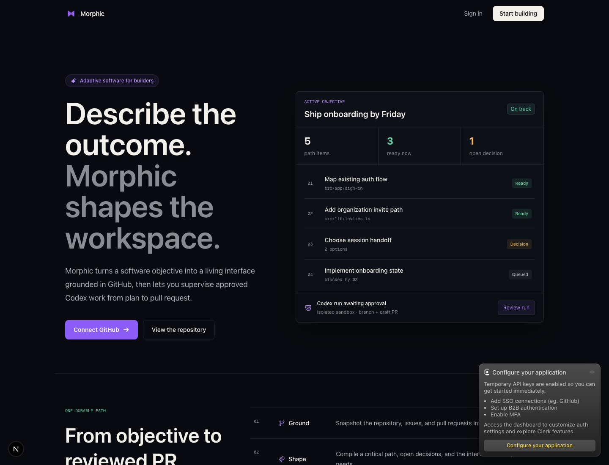
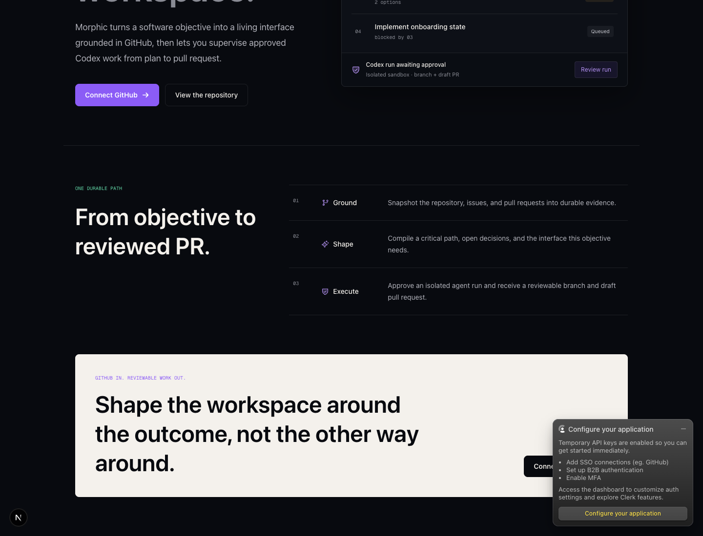
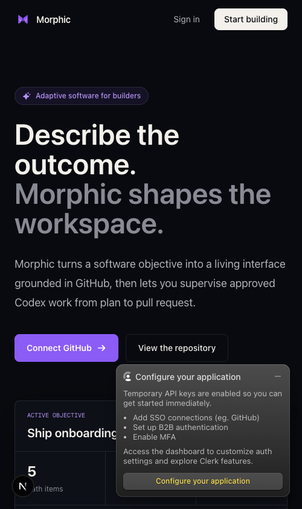
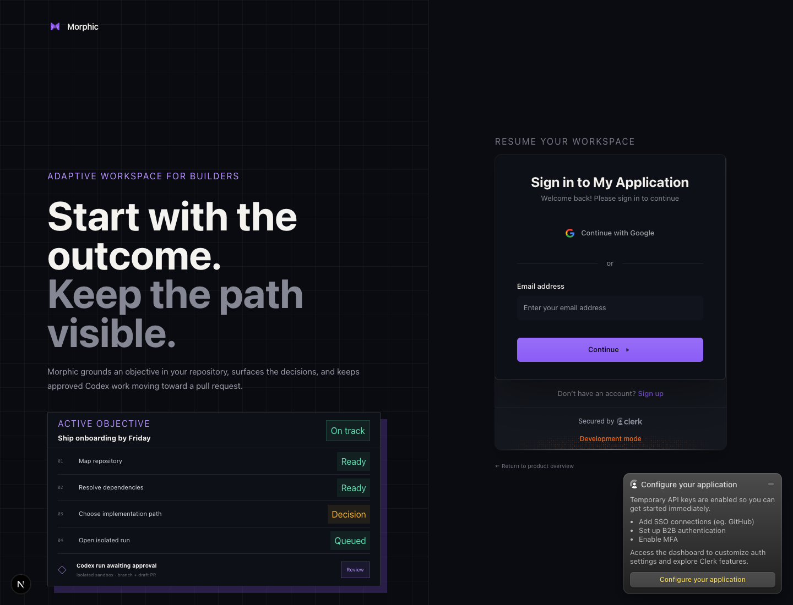
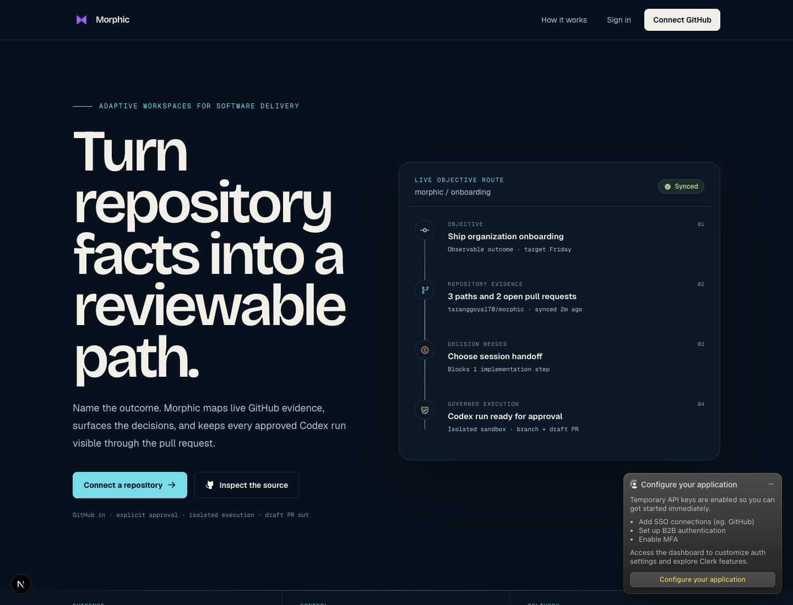
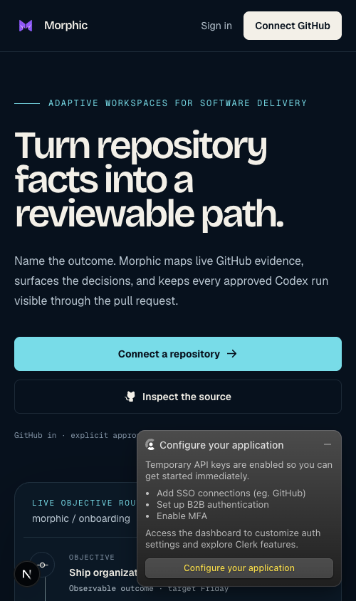
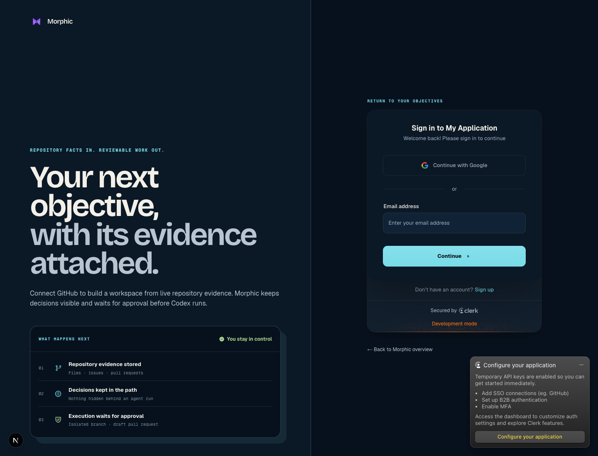
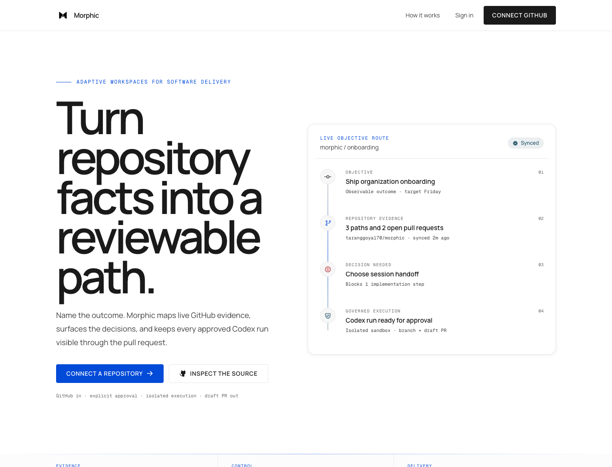
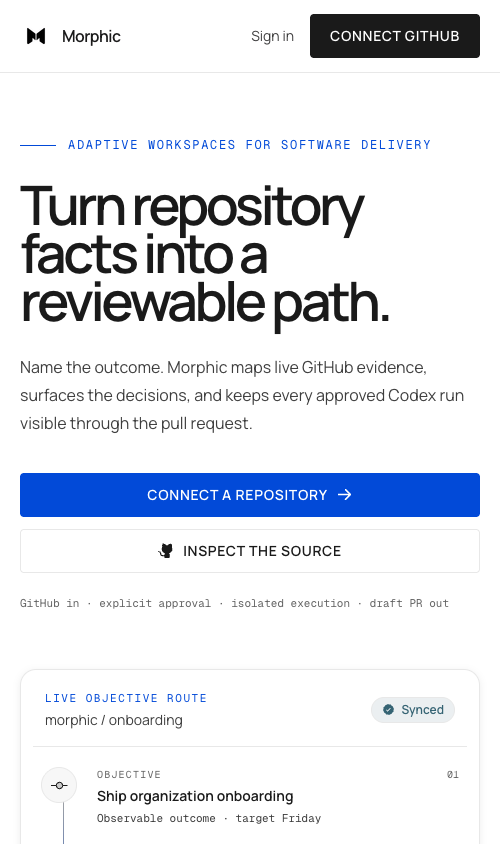
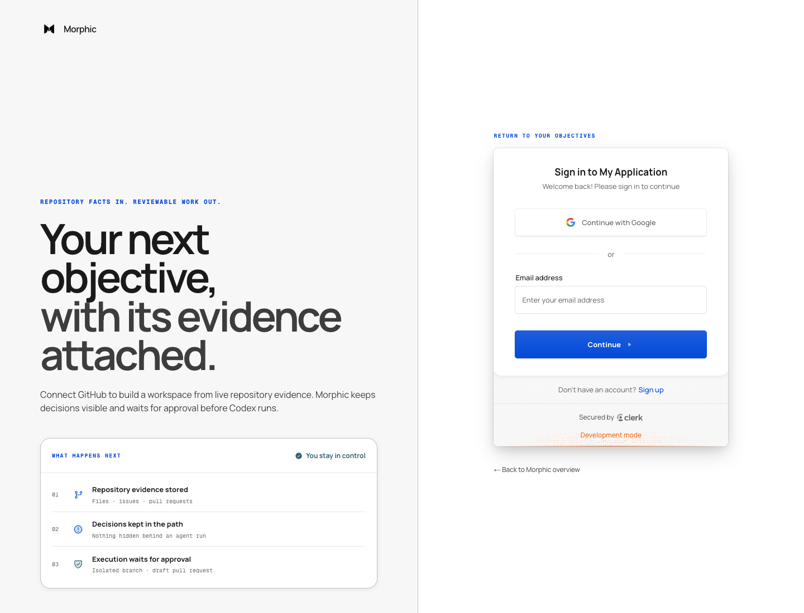

# Morphic product audit — baseline

Date: 2026-09-01  
Mode: Combined UX and accessibility audit  
Scope: Public landing page, public process section, mobile landing page, and sign-in entry

## User goal and accessibility target

The public experience should help a software builder understand what Morphic does, trust that work is grounded in real repository evidence, and confidently connect GitHub. The target is an understandable, keyboard-operable, responsive experience with visible focus and readable contrast.

## Step 1 — Understand the product promise

Health: **Needs focus**

### Strengths

- The page names the input (an objective) and the governed output (a pull request).
- The primary and secondary actions are visually distinct.
- The example workspace gives the product more credibility than a purely abstract hero.

### UX risks

- The headline describes the mechanism before establishing the concrete payoff. “Shapes the workspace” requires interpretation.
- The example workspace repeats four status treatments at once, so the eye has no obvious first evidence to inspect.
- Purple, near-black surfaces, rounded pills, and a dashboard card read like a generic AI developer-tool template rather than a product built around repository evidence.
- The compact brand mark, quiet navigation, and very large hero copy create an imbalanced hierarchy.

### Accessibility risks

- Several muted gray labels and tiny monospace annotations are likely difficult for low-vision users, especially at 200% zoom.
- Status depends heavily on color; the text labels help, but icons and clearer grouping would make the states easier to scan.

## Step 2 — Learn how Morphic works

Health: **Understandable, visually flat**

### Strengths

- The Ground → Shape → Execute sequence is short and accurate.
- The final call to action restates the core product model.

### UX risks

- The three steps are styled like table rows, which makes the product journey feel administrative rather than active.
- The light callout is visually disconnected from the dark page and its action can fall outside the captured viewport.
- The section does not show how stored evidence supports a decision or approved run, which is Morphic’s strongest trust story.

### Accessibility risks

- Small step numbers and labels have limited visual weight.
- The rigid three-column rows may become difficult to follow under text zoom or narrow reflow.

## Step 3 — Evaluate the mobile entry

Health: **Primary action visible; product proof delayed**

### Strengths

- Navigation and both hero actions fit without horizontal scrolling.
- Body copy remains readable at the captured viewport.

### UX risks

- The headline consumes most of the first screen and pushes the product proof below the fold.
- The example workspace begins with a clipped, dense card that requires substantial scrolling before its meaning is clear.
- The two actions have similar visual mass even though connecting GitHub is the intended next step.

### Accessibility risks

- The live Clerk development notice obscures content. This is a development-only artifact, but it prevents a clean screenshot-based review of the lower mobile state.
- The small uppercase and monospace labels remain difficult to read on a narrow viewport.

## Step 4 — Enter authentication

Health: **Functional but duplicative**

### Strengths

- The Clerk form is clearly separated from the product story.
- The email field has a visible label and the primary action is easy to find.

### UX risks

- The left panel repeats the landing-page example instead of helping the user understand what happens after sign-in.
- “Sign in to My Application” breaks the Morphic brand and reduces trust.
- The workspace card is too detailed for a sign-in decision and competes with the form.

### Accessibility risks

- The large decorative story panel precedes the form in reading order and may add noise for assistive-technology users.
- Some footer and return-link text is very low contrast.

## Highest-impact opportunities

1. Make the evidence chain the visual and narrative signature: objective → repository evidence → decision → approved run.
2. Replace the generic purple-on-black AI-tool palette with a restrained Morphic system built around cool evidence blue, warm decision orange, and paper-like review surfaces.
3. Let the interactive product proof lead the hero on desktop and appear earlier on mobile.
4. Rewrite public copy around the outcome: a reviewable path from repository facts to a pull request.
5. Simplify authentication so the form is the decision point and the supporting story explains trust, not another miniature dashboard.
6. Increase minimum label sizes, strengthen muted text contrast, preserve visible focus, and test responsive reflow at mobile and 200% zoom.

## Evidence limits and verification gaps

- The local environment used temporary Clerk development keys. The Clerk configuration notice overlays part of the page and is not a Morphic production component.
- Authenticated workspace screens could not be reached without signing in and provisioning linked services, so their audit must be completed through local component review and post-redesign verification.
- Screenshots alone cannot confirm screen-reader announcements, complete keyboard order, semantic relationships, or WCAG conformance.

## Redesign verification

### Public landing

Health: **Strong product hierarchy**

- The outcome and repository-backed proof now share the first viewport.
- The continuous evidence route makes objective, facts, decision, and governed execution understandable without reading a dense dashboard.
- Navigation, actions, and body copy use larger targets and stronger contrast.

### Mobile landing

Health: **Clear conversion path**

- The promise, explanation, and primary action fit before the product proof.
- Actions stack into full-width targets and the evidence route follows immediately after the trust line.
- The Clerk development notice still obscures lower content; this is an environment artifact rather than production UI.

### Authentication entry

Health: **Focused and trustworthy**

- Supporting content now explains what happens after authentication instead of repeating a fake workspace.
- The primary provider form adopts the evidence palette and a clearer 48px control size.
- The local Clerk tenant still says “My Application”; production Clerk branding must be configured to display “Morphic.”

## Palette revision — VoltAgent HP system

The first redesign solved the product hierarchy, but its dark navy, cyan, and orange direction still felt too close to the project's previous visual identity. The implementation was revised again using the HP system in [VoltAgent's awesome-design-md](https://github.com/VoltAgent/awesome-design-md/tree/main/design-md/hp) as a design reference.

### Revised public landing

- The default canvas is now pure white with near-black editorial typography.
- Electric blue is reserved for primary actions, evidence labels, and focus.
- Product proof uses a white 16px card with a quiet lift instead of dark dashboard chrome.
- Buttons use compact 4px geometry and tracked labels rather than soft, generic pills.

### Revised mobile landing

- The headline remains the dominant idea without forcing horizontal overflow.
- Both actions stack into 44px full-width controls.
- The live evidence route begins immediately after the trust line.

### Revised authentication entry

- The supporting story uses a cloud-gray band; the Clerk form stays on white.
- The primary form action uses the same electric blue as the public conversion path.
- Development overlays were hidden only for clean audit captures. The local Clerk tenant's “My Application” label remains a configuration issue, not a frontend component.
